**start:**

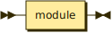

```
start    ::= module
```

**module:**

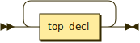

```
module   ::= top_decl+
```

referenced by:

* start

**top_decl:**

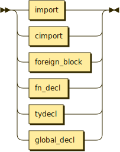

```
top_decl ::= import
           | cimport
           | foreign_block
           | fn_decl
           | tydecl
           | global_decl
```

referenced by:

* module

**import:**


```
import   ::= 'import' STRING ';'
```

referenced by:

* top_decl

**cimport:**


```
cimport  ::= 'cimport' STRING ';'
```

referenced by:

* top_decl

**foreign_block:**

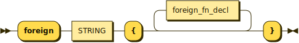

```
foreign_block
         ::= 'foreign' STRING '{' foreign_fn_decl* '}'
```

referenced by:

* top_decl

**foreign_fn_decl:**

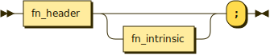

```
foreign_fn_decl
         ::= fn_header fn_intrinsic? ';'
```

referenced by:

* foreign_block

**fn_decl:**

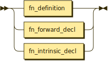

```
fn_decl  ::= fn_definition
           | fn_forward_decl
           | fn_intrinsic_decl
```

referenced by:

* top_decl

**fn_intrinsic_decl:**

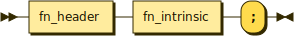

```
fn_intrinsic_decl
         ::= fn_header fn_intrinsic ';'
```

referenced by:

* fn_decl

**fn_forward_decl:**

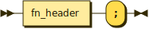

```
fn_forward_decl
         ::= fn_header ';'
```

referenced by:

* fn_decl

**fn_definition:**

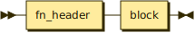

```
fn_definition
         ::= fn_header block
```

referenced by:

* fn_decl

**fn_header:**

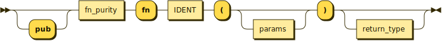

```
fn_header
         ::= 'pub'? fn_purity 'fn' IDENT '(' params? ')' return_type?
```

referenced by:

* fn_definition
* fn_forward_decl
* fn_intrinsic_decl
* foreign_fn_decl

**fn_purity:**


```
fn_purity
         ::= 'impure'?
```

referenced by:

* fn_header

**return_type:**

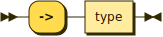

```
return_type
         ::= '->' type
```

referenced by:

* fn_header

**fn_intrinsic:**

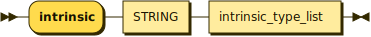

```
fn_intrinsic
         ::= 'intrinsic' STRING intrinsic_type_list
```

referenced by:

* fn_intrinsic_decl
* foreign_fn_decl

**intrinsic_type_list:**

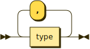

```
intrinsic_type_list
         ::= type ( ',' type )*
```

referenced by:

* fn_intrinsic

**params:**

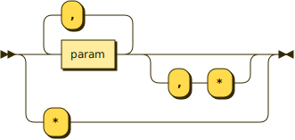

```
params   ::= param ( ',' param )* ( ',' '*' )?
           | '*'
```

referenced by:

* fn_header

**param:**

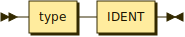

```
param    ::= type IDENT
```

referenced by:

* params

**tydecl:**

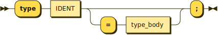

```
tydecl   ::= 'type' IDENT ( '=' type_body )? ';'
```

referenced by:

* top_decl

**type_body:**


```
type_body
         ::= type
           | struct_decl
           | enum_decl
```

referenced by:

* tydecl

**struct_decl:**

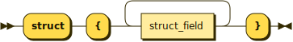

```
struct_decl
         ::= 'struct' '{' struct_field+ '}'
```

referenced by:

* type_body

**struct_field:**

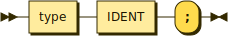

```
struct_field
         ::= type IDENT ';'
```

referenced by:

* struct_decl

**enum_decl:**

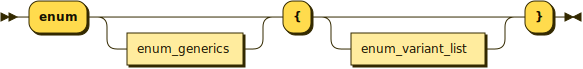

```
enum_decl
         ::= 'enum' enum_generics? '{' enum_variant_list? '}'
```

referenced by:

* type_body

**enum_generics:**


```
enum_generics
         ::= '<' IDENT ( ',' IDENT )* '>'
```

referenced by:

* enum_decl

**enum_variant_list:**

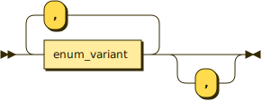

```
enum_variant_list
         ::= enum_variant ( ',' enum_variant )* ','?
```

referenced by:

* enum_decl

**enum_variant:**

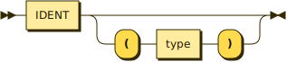

```
enum_variant
         ::= IDENT ( '(' type ')' )?
```

referenced by:

* enum_variant_list

**global_decl:**

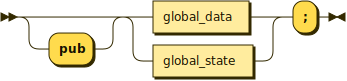

```
global_decl
         ::= 'pub'? ( global_data | global_state ) ';'
```

referenced by:

* top_decl

**global_data:**

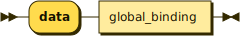

```
global_data
         ::= 'data' global_binding
```

referenced by:

* global_decl

**global_state:**

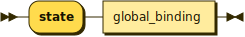

```
global_state
         ::= 'state' global_binding
```

referenced by:

* global_decl

**global_binding:**

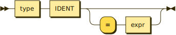

```
global_binding
         ::= type IDENT ( '=' expr )?
```

referenced by:

* global_data
* global_state

**block:**

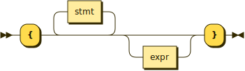

```
block    ::= '{' stmt* expr? '}'
```

referenced by:

* fn_definition
* iter_stmt
* primary
* while_stmt

**stmt:**

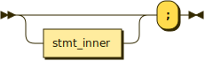

```
stmt     ::= stmt_inner? ';'
```

referenced by:

* block

**stmt_inner:**

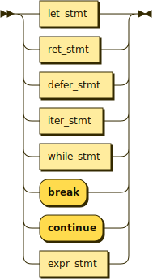

```
stmt_inner
         ::= let_stmt
           | ret_stmt
           | defer_stmt
           | iter_stmt
           | while_stmt
           | 'break'
           | 'continue'
           | expr_stmt
```

referenced by:

* stmt

**let_stmt:**

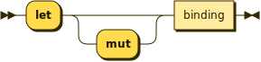

```
let_stmt ::= 'let' 'mut'? binding
```

referenced by:

* stmt_inner

**binding:**

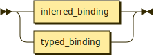

```
binding  ::= inferred_binding
           | typed_binding
```

referenced by:

* let_stmt

**inferred_binding:**

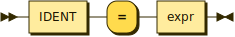

```
inferred_binding
         ::= IDENT '=' expr
```

referenced by:

* binding

**typed_binding:**

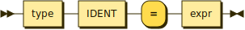

```
typed_binding
         ::= type IDENT '=' expr
```

referenced by:

* binding

**ret_stmt:**

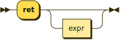

```
ret_stmt ::= 'ret' expr?
```

referenced by:

* stmt_inner

**defer_stmt:**

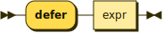

```
defer_stmt
         ::= 'defer' expr
```

referenced by:

* stmt_inner

**iter_stmt:**

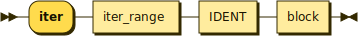

```
iter_stmt
         ::= 'iter' iter_range IDENT block
```

referenced by:

* stmt_inner

**iter_range:**

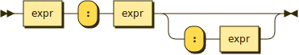

```
iter_range
         ::= expr ':' expr ( ':' expr )?
```

referenced by:

* iter_stmt

**while_stmt:**

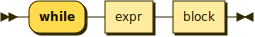

```
while_stmt
         ::= 'while' expr block
```

referenced by:

* stmt_inner

**expr_stmt:**

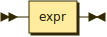

```
expr_stmt
         ::= expr
```

referenced by:

* stmt_inner

**expr:**

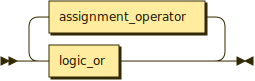

```
expr     ::= logic_or ( assignment_operator logic_or )*
```

referenced by:

* args
* as_expr
* block
* defer_stmt
* expr_stmt
* global_binding
* inferred_binding
* initializer_list
* iter_range
* match_arm
* match_expr
* postfix_part
* primary
* ret_stmt
* size_param
* typed_binding
* while_stmt

**assignment_operator:**


```
assignment_operator
         ::= '='
           | ':='
```

referenced by:

* expr

**multiplicative:**

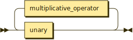

```
multiplicative
         ::= unary ( multiplicative_operator unary )*
```

referenced by:

* additive

**additive:**

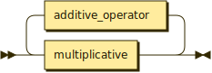

```
additive ::= multiplicative ( additive_operator multiplicative )*
```

referenced by:

* shift

**shift:**

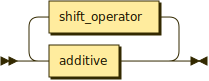

```
shift    ::= additive ( shift_operator additive )*
```

referenced by:

* relational

**relational:**

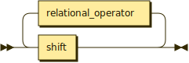

```
relational
         ::= shift ( relational_operator shift )*
```

referenced by:

* equality

**equality:**

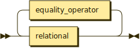

```
equality ::= relational ( equality_operator relational )*
```

referenced by:

* bit_and

**bit_and:**

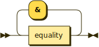

```
bit_and  ::= equality ( '&' equality )*
```

referenced by:

* bit_xor

**bit_xor:**

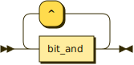

```
bit_xor  ::= bit_and ( '^' bit_and )*
```

referenced by:

* bit_or

**bit_or:**

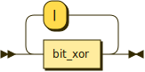

```
bit_or   ::= bit_xor ( '|' bit_xor )*
```

referenced by:

* logic_and

**logic_and:**

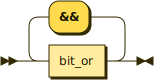

```
logic_and
         ::= bit_or ( '&&' bit_or )*
```

referenced by:

* logic_or

**logic_or:**

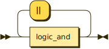

```
logic_or ::= logic_and ( '||' logic_and )*
```

referenced by:

* expr

**multiplicative_operator:**

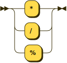

```
multiplicative_operator
         ::= '*'
           | '/'
           | '%'
```

referenced by:

* multiplicative

**additive_operator:**


```
additive_operator
         ::= '+'
           | '-'
```

referenced by:

* additive

**shift_operator:**


```
shift_operator
         ::= '<<'
           | '>>'
```

referenced by:

* shift

**relational_operator:**


```
relational_operator
         ::= '<'
           | '<='
           | '>'
           | '>='
```

referenced by:

* relational

**equality_operator:**


```
equality_operator
         ::= '=='
           | '!='
```

referenced by:

* equality

**unary:**


```
unary    ::= unary_prefix* primary postfix_part*
```

referenced by:

* multiplicative
* vec_literal
* vec_literal_tail

**unary_prefix:**


```
unary_prefix
         ::= '!'
           | '-'
           | '~'
           | 'load'
           | 'unbox'
           | 'ref'
           | 'box'
```

referenced by:

* unary

**postfix_part:**


```
postfix_part
         ::= '(' args? ')'
           | '[' expr ']'
           | ( '.' | '->' ) IDENT
```

referenced by:

* unary

**args:**


```
args     ::= expr ( ',' expr )*
```

referenced by:

* postfix_part

**primary:**


```
primary  ::= literal
           | enum_variant_literal
           | ( 'if' expr ( block 'else' 'if' expr )* ( block 'else' )? )? block
           | '(' expr ')'
           | initializer
           | match_expr
           | as_expr
           | size_expr
           | 'nil'
           | IDENT
```

referenced by:

* unary

**as_expr:**


```
as_expr  ::= 'as' '<' type '>' '(' expr ')'
```

referenced by:

* primary

**size_expr:**


```
size_expr
         ::= 'size' size_param
```

referenced by:

* primary

**size_param:**


```
size_param
         ::= '<' type '>'
           | '(' expr ')'
```

referenced by:

* size_expr

**literal:**


```
literal  ::= HEX
           | OCT
           | BIN
           | INT
           | FLOAT
           | STRING
           | CHAR
           | mat_literal
           | vec_literal
```

referenced by:

* pattern
* primary

**mat_literal:**


```
mat_literal
         ::= 'Mat' '<' mat_inner '>'
```

referenced by:

* literal

**mat_inner:**


```
mat_inner
         ::= mat_row+
```

referenced by:

* mat_literal

**mat_row:**


```
mat_row  ::= vec_literal ','
```

referenced by:

* mat_inner

**vec_literal:**


```
vec_literal
         ::= 'Vec' '<' unary vec_literal_tail? '>'
```

referenced by:

* literal
* mat_row

**vec_literal_tail:**


```
vec_literal_tail
         ::= ( ',' unary )+
```

referenced by:

* vec_literal

**initializer:**


```
initializer
         ::= '{' initializer_list '}'
```

referenced by:

* primary

**initializer_list:**


```
initializer_list
         ::= expr ( ',' | ( ',' expr )+ ','? )
```

referenced by:

* initializer

**match_expr:**


```
match_expr
         ::= 'match' expr '{' match_arm+ '}'
```

referenced by:

* primary

**match_arm:**


```
match_arm
         ::= pattern '=>' expr
```

referenced by:

* match_expr

**pattern:**


```
pattern  ::= '_'
           | literal
           | pattern_enum pattern_payload?
```

referenced by:

* match_arm

**pattern_enum:**


```
pattern_enum
         ::= IDENT ( '::' IDENT )?
```

referenced by:

* pattern

**pattern_payload:**


```
pattern_payload
         ::= '(' pattern_binding ( ',' pattern_binding )* ')'
```

referenced by:

* pattern

**pattern_binding:**


```
pattern_binding
         ::= IDENT
           | '_'
```

referenced by:

* pattern_payload

**enum_variant_literal:**


```
enum_variant_literal
         ::= IDENT '::' enum_variant_literal_typed? IDENT
```

referenced by:

* primary

**enum_variant_literal_typed:**


```
enum_variant_literal_typed
         ::= type_arguments '::'
```

referenced by:

* enum_variant_literal

**type_path:**


```
type_path
         ::= IDENT '::' type_arguments
```

referenced by:

* type_primary

**type_arguments:**


```
type_arguments
         ::= '<' type ( ',' type )* '>'
```

referenced by:

* enum_variant_literal_typed
* type_path

**type:**


```
type     ::= type_primary type_suffix*
```

referenced by:

* as_expr
* enum_variant
* function_type_params
* global_binding
* intrinsic_type_list
* param
* return_type
* size_param
* struct_field
* type_arguments
* type_body
* type_cell
* type_function_meta
* typed_binding

**type_primary:**


```
type_primary
         ::= builtin_type
           | type_path
           | type_cell
           | type_function
           | type_vararg_function
           | IDENT
```

referenced by:

* type

**builtin_type:**


```
builtin_type
         ::= NUMERIC_TYPE
           | VEC_TYPE
           | MAT_TYPE
           | 'float'
           | 'void'
           | 'str'
```

referenced by:

* type_primary

**type_cell:**


```
type_cell
         ::= 'Cell' '<' type '>'
```

referenced by:

* type_primary

**type_function:**


```
type_function
         ::= 'Function' type_function_meta
```

referenced by:

* type_primary

**type_vararg_function:**


```
type_vararg_function
         ::= 'VAFunction' type_function_meta
```

referenced by:

* type_primary

**type_function_meta:**


```
type_function_meta
         ::= '<' '(' ( function_type_params | '_' ) ')' '->' type '>'
```

referenced by:

* type_function
* type_vararg_function

**function_type_params:**


```
function_type_params
         ::= type ( ',' type )*
```

referenced by:

* type_function_meta

**type_suffix:**


```
type_suffix
         ::= '*'
           | '^'
           | array_suffix
```

referenced by:

* type

**array_suffix:**


```
array_suffix
         ::= '[' INT ']'
```

referenced by:

* type_suffix

**NUMERIC_TYPE:**


```
NUMERIC_TYPE
         ::=
           | [iu] [1-9] [0-9]*
           |
```

referenced by:

* builtin_type

**VEC_TYPE:**


```
VEC_TYPE ::=
           | fvec [1-9] [0-9]*
           |
```

referenced by:

* builtin_type

**MAT_TYPE:**


```
MAT_TYPE ::=
           | f? mat [1-9] [0-9]* x [1-9] [0-9]*
           |
```

referenced by:

* builtin_type

**FLOAT:**


```
FLOAT    ::= ( '0' | NONZERO_DIGIT DIGIT* ) '.' DIGIT+
```

referenced by:

* literal

**INT:**


```
INT      ::= '0'
           | NONZERO_DIGIT DIGIT*
```

referenced by:

* array_suffix
* literal

**HEX:**


```
HEX      ::= '0' 'x' HEX_DIGIT+
```

referenced by:

* literal

**OCT:**


```
OCT      ::= '0' 'o' OCT_DIGIT+
```

referenced by:

* literal

**BIN:**


```
BIN      ::= '0' 'b' BIN_DIGIT+
```

referenced by:

* literal

**STRING:**


```
STRING   ::= '"' string_char* '"'
```

referenced by:

* cimport
* fn_intrinsic
* foreign_block
* import
* literal

**string_char:**


```
string_char
         ::= string_escape
           | string_plain
```

referenced by:

* STRING

**string_plain:**


```
string_plain
         ::=
           | [^"\]
           |
```

referenced by:

* string_char

**string_escape:**


```
string_escape
         ::= '\\' escaped_char
```

referenced by:

* string_char

**escaped_char:**


```
escaped_char
         ::=
           | .
           |
```

referenced by:

* char_escape
* string_escape

**CHAR:**


```
CHAR     ::= "'" char_char "'"
```

referenced by:

* literal

**char_char:**


```
char_char
         ::= char_escape
           | char_plain
```

referenced by:

* CHAR

**char_plain:**


```
char_plain
         ::=
           | [^'\]
           |
```

referenced by:

* char_char

**char_escape:**


```
char_escape
         ::= '\\' escaped_char
```

referenced by:

* char_char

**IDENT:**


```
IDENT    ::= IDENT_START IDENT_CONT* ( '-' IDENT_CONT+ )*
```

referenced by:

* enum_generics
* enum_variant
* enum_variant_literal
* fn_header
* global_binding
* inferred_binding
* iter_stmt
* param
* pattern_binding
* pattern_enum
* postfix_part
* primary
* struct_field
* tydecl
* type_path
* type_primary
* typed_binding

**IDENT_START:**


```
IDENT_START
         ::=
           | [A-Za-z_]
           |
```

referenced by:

* IDENT

**IDENT_CONT:**


```
IDENT_CONT
         ::=
           | [A-Za-z0-9_]
           |
```

referenced by:

* IDENT

**DIGIT:**


```
DIGIT    ::=
           | [0-9]
           |
```

referenced by:

* FLOAT
* INT

**NONZERO_DIGIT:**


```
NONZERO_DIGIT
         ::=
           | [1-9]
           |
```

referenced by:

* FLOAT
* INT

**HEX_DIGIT:**


```
HEX_DIGIT
         ::=
           | [0-9a-fA-F]
           |
```

referenced by:

* HEX

**OCT_DIGIT:**


```
OCT_DIGIT
         ::=
           | [0-7]
           |
```

referenced by:

* OCT

**BIN_DIGIT:**


```
BIN_DIGIT
         ::=
           | [0-1]
           |
```

referenced by:

* BIN

**WS:**


```
WS       ::= [#x20#x09#x0A#x0D]+
```

**COMMENT:**


```
COMMENT  ::= '//' comment_char* line_break?
```

**comment_char:**


```
comment_char
         ::=
           | [#x00-#x09#x0B-#x0C#x0E-#x10FFFF]
           |
```

referenced by:

* COMMENT

**ML_COMMENT:**


```
ML_COMMENT
         ::= '/*' ml_comment_char* '*/'
```

**ml_comment_char:**


```
ml_comment_char
         ::=
           | [#x00-#x10FFFF]
           |
```

referenced by:

* ML_COMMENT

**line_break:**


```
line_break
         ::= #x0D #x0A?
           | #x0A
```

referenced by:

* COMMENT

## 
 <sup>generated by [RR - Railroad Diagram Generator][RR]</sup>

[RR]: https://www.bottlecaps.de/rr/ui